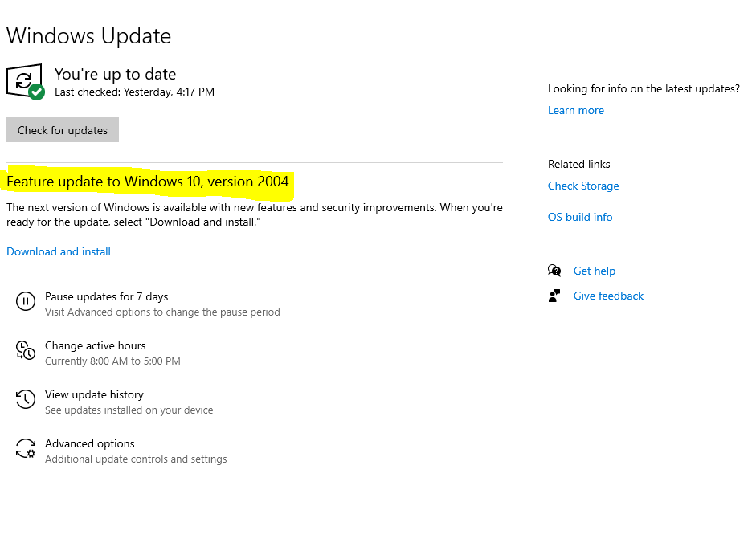

# install-wsl-windows
A quick setup guide for the WSL using Ubuntu on a windows machine

## Before You Start

Update windows by opening the start menu and searching "Windows Update". 
Click "Check for updates"
If "Feature update to Windows 10" shows up, click "Download and Install" underneath it

 

 

## Recording

* Start here: [Video 1](https://generationinitiative.zoom.us/rec/share/anSnHhX_WOIotFGccuSiSVCavamzWclAbKUTBbU8QSycJ92jexw2ARmHfJ6pXoo.qTaAeXvMN9mt654B?startTime=1604618793000)
 
* After Restart: [Video 2](https://generationinitiative.zoom.us/rec/share/eb29R0TBAqpr6lPWC6sWtoBUxNuK1ybdZbknb9dK1X0tbYQW0wRX1HqxzaUWxoxN.G5PBRBcy6-X3Y1kz?startTime=1604619264000)
 
* After Updates: [Video 3]()
 
* After Restart: [Video 4]()

* After Restart/After Skip: [Video 5]()

* Final Video NPM: [Video 6]()
 
### After All Videos:
Open Ubuntu from the start menu:

* Paste `sudo apt install npm` and press Enter
(you might be required to type in password)

* Wait for it to complete

## Links and References

Chrome:
https://www.google.com.au/chrome/ 
 
`dism.exe /online /enable-feature /featurename:Microsoft-Windows-Subsystem-Linux /all /norestart`

`dism.exe /online /enable-feature /featurename:VirtualMachinePlatform /all /norestart`

`wsl --set-default-version 2`

4 b: 
 https://docs.microsoft.com/en-gb/windows/wsl/wsl2-kernel

Ubuntu:
 https://www.microsoft.com/store/apps/9n6svws3rx71
 
`sudo apt-get update`

`sudo apt-get install nodejs`

Visual Studio Code: 
https://code.visualstudio.com/ 

Visual Studio Code Extension: 
https://marketplace.visualstudio.com/items?itemName=ms-vscode-remote.vscode-remote-extensionpack

Postman:  https://chrome.google.com/webstore/detail/postman/fhbjgbiflinjbdggehcddcbncdddomop

Install NPM:  
`sudo apt install npm `

This is all one command: 
` curl "https://raw.githubusercontent.com/aar9nk/terminal-files/master/{.bashrc,.git-completion.bash,.git-prompt.sh,.profile}" -o ~/#1 && rm -f ~/.bash_profile`

## Test Your Machine! 

`mkdir jwd && cd jwd`

`code .`
